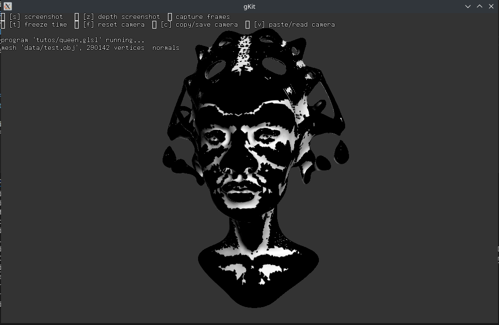
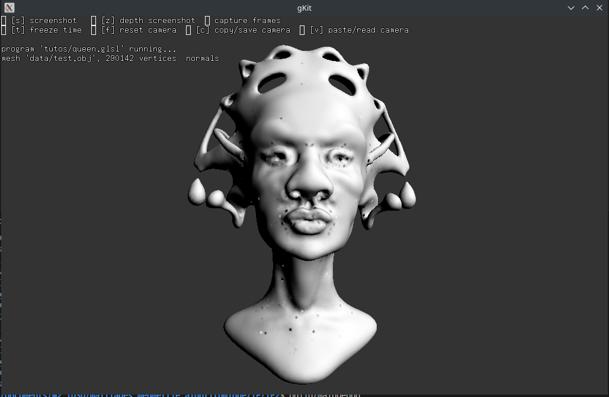
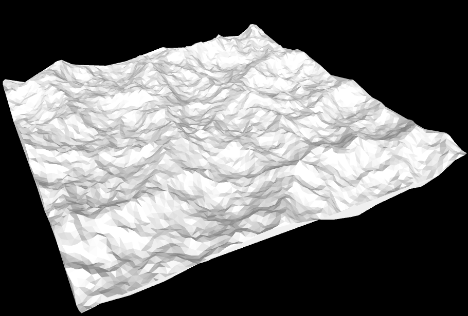
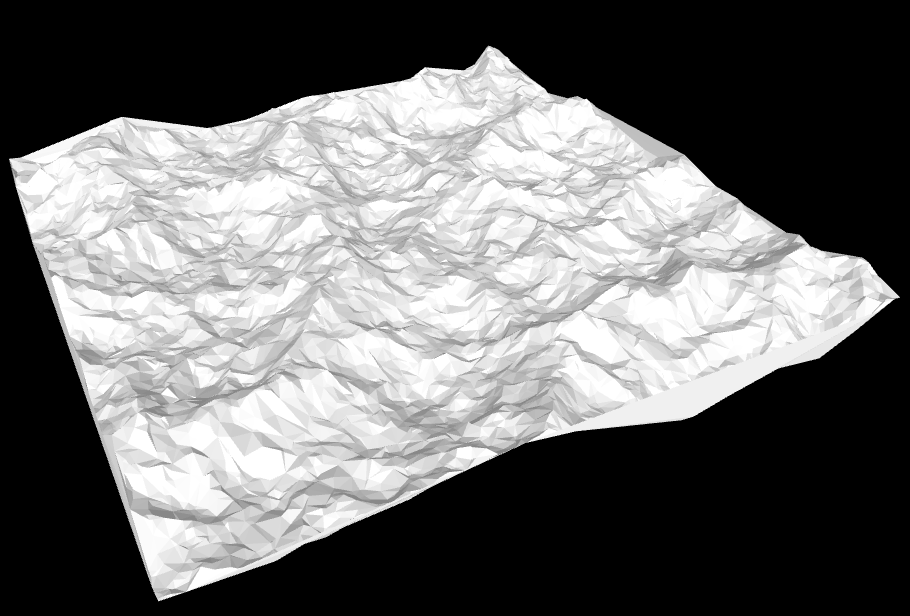
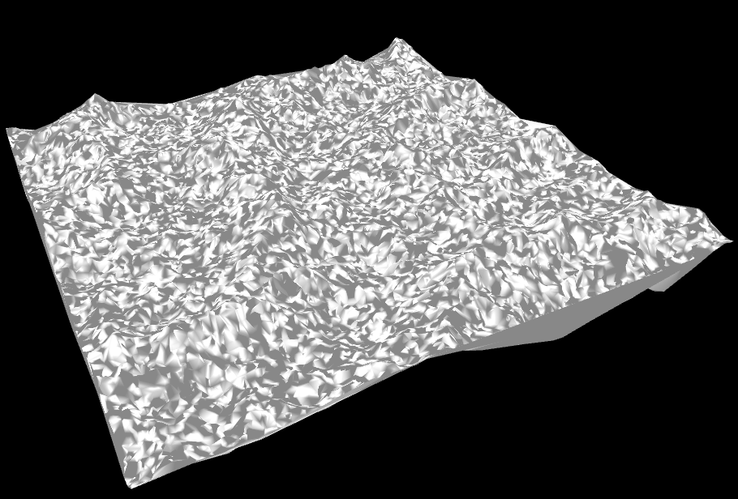

# TP 1-2-3
## compiler et exécuter le programme
Il suffit d'avoir meson.<br>
ouvrir terminal et faire : 
```
meson setup --reconfigure build
meson compile -C build
build/MainDebug
```
## importation exportation mesh

La base de code nous permet d'importer un mesh provenant d'un fichier ``.off`` et d'exporter notre mesh en ``.off`` ou point ``obj`` au choix. Il aussi possible de tourner autour d'un point et de visualiser le résultat une fois après avoir sauvegarder notre mesh en ``.off``.
Pour ce qui est de la visualisation du mesh, il est nécessaire de passer par [ce viewer](https://3dviewer.net/index.html) pour visualiser les ``.off``. De plus, pour visualiser les ``.obj``, je me suis servie du viewer "shader_kit" proposé par Gkit2Light, la base de code développer par Jean-Claude Iehl. Il est tout de même possible de visualiser les ``.obj`` avec [ce même viewer](https://3dviewer.net/index.html).

## Calcul Laplacien
Après calcul du laplacien, nous obtenons ce rendu de mesh avec une source de lumière.

Toutefois, on remarque que plusieurs normales sont inversées.
C'est pour cela que pour chaque normales au vertex, nous allons aussi calculer la normale au triangle de ce vertex et verifier si le produit cartésien de c'est deux vecteurs et positif et négatif. Cela nous permettra de prendre la normale opposée si cette dernière n'était pas dans la même direction que celle du triangle.

Nous obtenons ainsi cette image. On peut observer que certaines aspérités sont présentes sur le mesh.

## Courbure

La courbure est calculée en à la suite de chaque laplacien mais elle est normalement pas affiché car je n'ai malheureusement pas trouvé de moyen pour l'afficher à l'aide d'une couleur via dans mes ``.obj``. Je comptais utiliser des coordonnées de texture qui seraient généré en fonction de ma valeur de courbure et la texture utilisée serait [celle-ci](data/heat.png).
<br>
<br>

# TP 4

Le but de ce TP consistait à importer un fichier ayant des informations sous formes de nuages de points afin de le trianguler en respectant la contrainte de delaunay.
Cette contrainte implique que pour chaque triangle représentant notre mesh, chaque cercle circonscrit à un triangle ne contiendra qu'uniquement les points de dernier et aucun autre.

## Fonctionnalité implémentées

Pour réaliser ce TP, la classe ``MeshOpened`` qui hérite de la classe ``Mesh`` a été ajouté afin de pouvoir traiter les maiillages ouverts.
Deux fonctionnalités primaires nous intéréssant ont été implémentées. La première est ``EdgeFlip(const arete&)`` qui permet de flip l'arête passée en paramètre.
La seconde fonctionnalité est ``split3(const indiceFace indiceFace, const indiceGlobalSommet indiceVertex)`` permettant de diviser en trois le triangle auquel nous allons rajouter un point.
La fonction ``Lawson`` permet de réaliser l'algorithme portant le même nom ce qui permet de concerver un maillage ayant des triangles de Delaunay.
Enfin, toutes les fonctions citées sont utilisée dans la fonction d'ajout de point qui vérifie aussi si le nouveau point inséré est à l'intérieur de l'enveloppe convexe de notre maillage. La version naïve de l'algorithme vérifiant si un point est dans l'enveloppe convexe est utilisée dans ce code.
Une autre fonctionnalité mineur a été implémenté. Cette fonction est ``void edgeSplit(const arete& edge, const float interpolateValue);`` qui permet simplement de diviser une arête en deux (``interpolateValue`` est une valeur entre 0 et 1 qui permet split plus ou moins proche d'un des deux points de l'arête, 0.5 représentant le milieu).

## Mesures de temps sur les données des Alpes.


|Données utilisées|temps de création du maillage (en secondes)|temps de calcul des normales (en millisecondes)|
|:-----------------:|:-----------------------------------------:|:-------:|
|noise_poisson|1.91|33|
|noise_random_1|4.98|54|
|noise_random_2|20.08|113|

<br>
<br>

Malheureusement, Il n'a pas été possible de réaliser ces mesures de temps avec les données des fichiers ``alpes_poisson.txt`` et ``alpes_random_2.txt`` car lors de l'ajout des points, nous tombons dans un cas particulier où une arête se fait flip à l'infini.

### Résultats


Noise poisson
<br>
<br>


Noise random 1
<br>
<br>


Noise random 2
<br>
<br>


Noise random 2 lissé. Le rendu est assez étrange.
